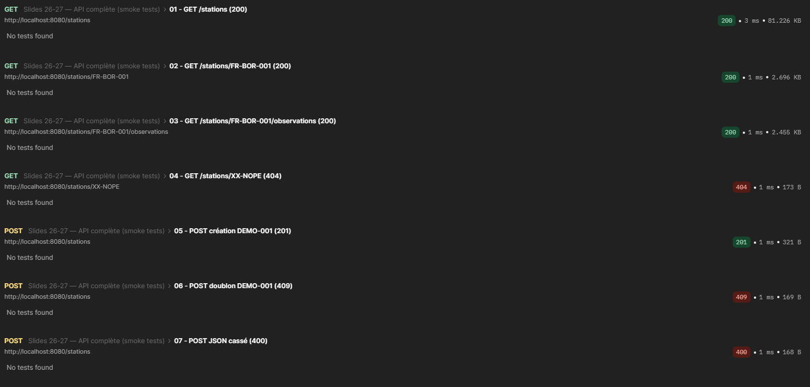
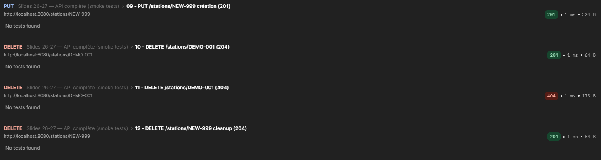

# API REST météo  -  Go

---

# Lancer le serveur

```bash
cd J3\
go run .
```

Le serveur démarre sur :

```txt
http://localhost:8080
```

---

# Routes disponibles

## GET /stations

Permet de retourner toutes les stations météo.

Status attendu :

```txt
200 OK
```

---

## GET /stations/{id}

Permet de retourner une station par identifiant.

Exemple :

```txt
GET /stations/FR-BOR-001
```

Status possibles :

```txt
200 OK
404 Not Found
```

---

## GET /stations/{id}/observations

Permet de retourner uniquement les observations météo d’une station.

Exemple :

```txt
GET /stations/FR-BOR-001/observations
```

Status possibles :

```txt
200 OK
404 Not Found
```

---

## POST /stations

Permet de créer une nouvelle station.

Exemple de body JSON :

```json
{
  "id": "DEMO-001",
  "name": "Démo",
  "country_code": "FR",
  "altitude": 42
}
```

Status possibles :

```txt
201 Created
400 Bad Request
409 Conflict
```

---

## PUT /stations/{id}

Permet de créer OU de remplacer une station.

Exemple :

```txt
PUT /stations/DEMO-001
```

Status possibles :

```txt
200 OK
201 Created
400 Bad Request
```

---

## DELETE /stations/{id}

Permet de supprimer une station.

Exemple :

```txt
DELETE /stations/DEMO-001
```

Status possibles :

```txt
204 No Content
404 Not Found
```

---


# Collection Postman

Le projet a été validé avec la collection Postman fournie par l'enseignant.

Validation utilisée :

```txt
Slides 26-27 — API complète (smoke tests)
```

Statuts HTTP attendus :

```txt
01 - GET /stations (200)
02 - GET /stations/FR-BOR-001 (200)
03 - GET /stations/FR-BOR-001/observations (200)
04 - GET /stations/XX-NOPE (404)
05 - POST création DEMO-001 (201)
06 - POST doublon DEMO-001 (409)
07 - POST JSON cassé (400)
08 - PUT /stations/DEMO-001 remplacement (200)
09 - PUT /stations/NEW-001 création (201)
10 - DELETE /stations/DEMO-001 (204)
11 - DELETE /stations/DEMO-001 (404)
12 - DELETE /stations/NEW-999 cleanup (204)
```

---

# Captures d'écran du Runner Postman




